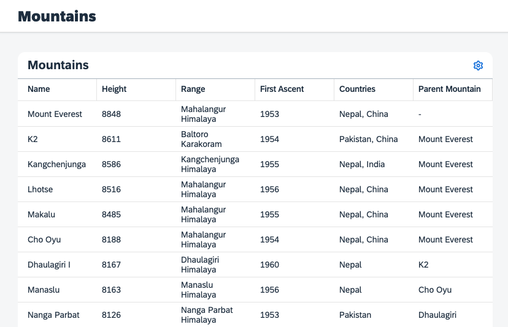

[](webapp)
# Exercise 1: How to Use the MDC Table

This exercise will guide you through the process of creating a JSONTableDelegate and integrating it with an MDC Table in an XML view. These elements are crucial when building an MDC application that interfaces with JSON data.

## Step 1: Create a JSONTableDelegate

Firstly, we will create a new JavaScript file named `JSONTableDelegate.js` inside the `delegate` directory.

This file serves as a delegate for a UI5 table. Delegates offer a method to customize the behavior of a control without modifying the control itself. In this instance, we're teaching the table how to interact with the sample JSON data.

Below is the code for the delegate. It extends the [`sap/ui/mdc/TableDelegate`](https://sdk.openui5.org/api/module:sap/ui/mdc/TableDelegate) and includes functions to extract properties from the JSON metadata provided in `JSONPropertyInfo.js` in the model folder, add items to the table, delete items from the table, and revise the table's binding information. Take a look at the implementation of the methods!
###### delegate/JSONTableDelegate.js
```javascript
sap.ui.define([
	"sap/ui/mdc/TableDelegate",
	"sap/ui/mdc/table/Column",
	"sap/m/Text",
	"sap/ui/core/Core",
	"mdc/tutorial/model/metadata/JSONPropertyInfo"
], function (
	TableDelegate, Column, Text, Core, JSONPropertyInfo) {
	"use strict";

	const JSONTableDelegate = Object.assign({}, TableDelegate);

	JSONTableDelegate.fetchProperties = async () =>
		JSONPropertyInfo.filter((oPI) => oPI.name !== "$search");

	JSONTableDelegate.addItem = async (oTable, sPropertyName) => {
		const oPropertyInfo = JSONPropertyInfo.find(oPI => oPI.name === sPropertyName);
		const sId = oTable.getId() + "---col-" + sPropertyName;
		return Core.byId(sId) ?? await _createColumn(sId, oPropertyInfo);
	};

	const _createColumn = async (sId, oPropertyInfo) => {
		const sPropertyName = oPropertyInfo.name;
		return new Column(sId, {
			propertyKey: sPropertyName,
			header: oPropertyInfo.label,
			template: new Text({
				text: {
					path: "mountains>" + sPropertyName,
					type: oPropertyInfo.dataType
				}
			})
		});
	}

	JSONTableDelegate.removeItem = async (oTable, oColumn) => {
		oColumn.destroy();
		return true; // allow default handling
	};

	JSONTableDelegate.updateBindingInfo = (oTable, oBindingInfo) => {
		TableDelegate.updateBindingInfo.call(JSONTableDelegate, oTable, oBindingInfo);
		oBindingInfo.path = oTable.getPayload().bindingPath;
		oBindingInfo.templateShareable = true;
	};

	return JSONTableDelegate;
}, /* bExport= */false);
```
The PropertyInfo provides all necessary metadata for the MDC Table to function. Take a look at this excerpt of the `JSONPropertyInfo.js` file to understand how the two properties `name` and `height` are defined.
###### model/metadata/JSONPropertInfo.js
```javascript
	{
		name: "name",
		label: "Name",
		visible: true,
		path: "name",
		dataType: "sap.ui.model.type.String"
	},{
		name: "height",
		label: "Height",
		visible: true,
		path: "height",
		dataType: "sap.ui.model.type.Integer"
	}
```
>ℹ️ For a comprehensive description of what information should be contained within `PropertyInfo` objects, see the [API Reference](https://sdk.openui5.org/api/sap.ui.mdc.table.PropertyInfo). In real life scenarios you might retrieve this metadata from the data service and you would have to translate it into the PropertyInfo format, easy to digest for our Controls.
## Step 2: Use the MDC Table

Next, we will enhance the XML view named `Mountains.view.xml` in the `view` directory.

This XML view defines the user interface for a screen in our UI5 application. The view comprises a DynamicPage with a Table control in its content area. The table is set up to use our custom JSONTableDelegate.

Below is the code you can add to content aggregation of the DynamicPage in the XML view. It includes a table with columns for name, height, range, first ascent, countries, and parent mountain, along with the data bindings. The corresponding model is automatically generated based on our sample data via the `manifest.json`.
###### view/Mountains.view.xml
```xml
			<mdc:Table
				id="table"
				header="Mountains"
				p13nMode="Sort,Column"
				type="ResponsiveTable"
				threshold="100"
				filter="filterbar"
				showRowCount="false"
				delegate="{
					name: 'mdc/tutorial/delegate/JSONTableDelegate',
					payload: {
						bindingPath: 'mountains>/mountains',
						searchKeys: ['name', 'range', 'parent_mountain', 'countries']
					}
				}">
				<mdct:Column
					propertyKey="name"
					header="Name">
					<Text text="{mountains>name}"/>
				</mdct:Column>
				<mdct:Column
					propertyKey="height"
					header="Height">
					<Text text="{path: 'mountains>height'}"/>
				</mdct:Column>
				<mdct:Column
					propertyKey="range"
					header="Range">
					<Text text="{mountains>range}"/>
				</mdct:Column>
				<mdct:Column
					propertyKey="first_ascent"
					header="First Ascent">
					<Text text="{mountains>first_ascent}"/>
				</mdct:Column>
				<mdct:Column
					propertyKey="countries"
					header="Countries">
					<Text text="{mountains>countries}"/>
				</mdct:Column>
				<mdct:Column
					propertyKey="parent_mountain"
					header="Parent Mountain">
					<Text text="{mountains>parent_mountain}"/>
				</mdct:Column>
			</mdc:Table>
```
> ℹ️ Pay attention to how the controls are specified. All the MDCs included in the XML view will initially appear on the screen without any additional personalization. While this may seem superfluous when also providing the Control creation method in the delegate, it allows you to establish a default without any hassle. Alternatively, you could opt to not provide any controls here and add them later through personalization.

Run the application and see how with just the few lines of code you added, you get a personalizable table that shows properties of your JSON data! 😱


## Summary

The main takeaway is that delegates offer a potent mechanism to adapt the behavior of sap.ui.mdc controls without altering the controls themselves. With a custom delegate, you can customize a control to handle a specific type of data, such as JSON data. Furthermore, XML views provide a declarative means to define the user interface for a screen in a UI5 application.

Proceed to - [Exercise 2](../ex2/readme.md)