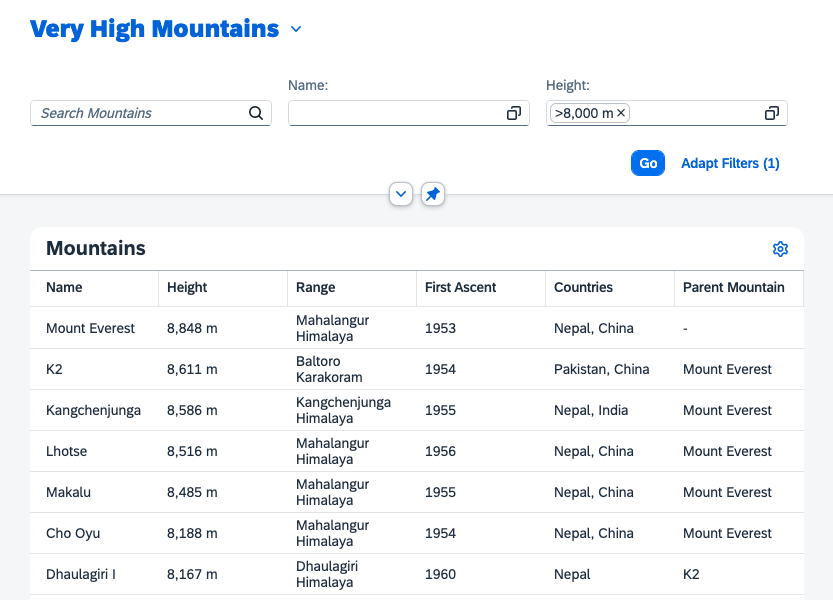

[](webapp)
# Exercise 5: How to Enable Variant Management
Now that we've activated all of the remarkable features highlighted in the previous exercises, there's just one more step to complete. We want our users to have the ability to save their settings that they've applied in the sap.ui.mdc controls. To achieve this, we'll incorporate a [`VariantManagement`](https://sdk.openui5.org/api/sap.ui.fl.variants.VariantManagement) control.

## Step 1: Incorporate Variant Management
We'll utilize the `sap/ui/fl/variants/VariantManagement` control. This not only provides persistency for user settings, but also offers support for key user adaptations. The implementation is straightforward, replace the Title control as follows:
###### view/Mountains.view.xml
```xml
			<f:DynamicPageTitle>
				<f:heading>
					<vm:VariantManagement id="variants" for="filterbar, table"/>
				</f:heading>
			</f:DynamicPageTitle>
```
Try it and create your favorite variant! How easy was that? 😎



>ℹ️ For this tutorial we use a local storage persistency, which does not protect data by default and is not meant for productive use. On BTP, SAP S/4 HANA or ABAP platform we recommend SAPUI5 flexibility services. For more information, see [Features and Availability](https://help.sap.com/docs/UI5_FLEXIBILITY/430e2c1a4ff241bc8162df4bf51e0730/41ada93054994698ab9067855bb85fe1.html).
## Conclusion
Well done! You've successfully built a fully customizable list report application using sap.ui.mdc. You've learned how to manipulate the controls with the relevant delegates and discovered methods to customize and extend them. Armed with this toolkit, you're now equipped to develop metadata-driven applications for any UI5 model and protocol! Congratulations! 🎉
