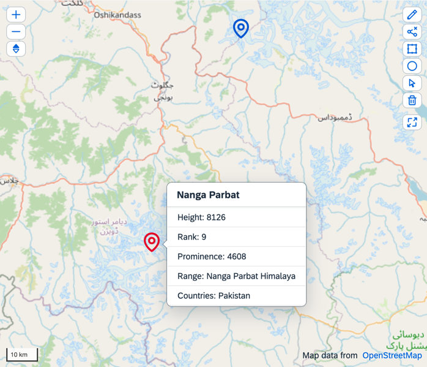

[](webapp)

# Exercise 6: How to Use the MDC Geomap
In this exercise we will learn how to create a JSONGeomapDelegate for an MDC Geomap in an XMLView. These elements are crucial when building an MDC application that interacts with JSON data.

## Step 1: Create a JSONGeomapDelegate

Firstly, let's create a new directory named `delegate` within the `webapp` directory. Also, add a JavaScript file named `JSONGeomapDelegate.ts` inside the `delegate` directory.

This file serves as a delegate for a UI5 geomap. Delegates offer a method to customize the behavior of a control without modifying the control itself. In this example, it contains the logic of how the geomap interacts with the sample JSON data.

Below is the code for the delegate. It extends the [`sap/ui/mdc/GeomapDelegate`](https://sdk.openui5.org/api/module:sap/ui/mdc/GeomapDelegate) and includes functions to extract properties from the JSON metadata provided in `JSONPropertyInfo.ts` in the model folder, add items to the geomap, delete items from the geomap, and revise the geomap's binding information.

Thanks to TypeScript we can provide a delegate-specific interface for the payload, which clearly defines what content can be provided. In this case, the `bindingPath` is specified, so that the geomap knows from where to get its data. Take a look at the implementation!
(We separate it in parts with some explanations to bring more clarity.)

### Create the delegate extending the base one

In the sample code below, we create a new delegate we will later use for our Geomap control.

###### delegate/JSONGeomapDelegate.ts
```typescript
import GeomapDelegate from "sap/ui/mdc/GeomapDelegate"
import JSONPropertyInfo from "mdc/tutorial/model/metadata/JSONPropertyInfo"
import {Geomap as MDCGeomap, PropertyInfo as GeomapPropertyInfo} from "sap/ui/mdc/Geomap"
import JSONBaseDelegate from "./JSONBaseDelegate"

interface GeomapPayload {
    bindingPath: string
}

const JSONGeomapDelegate = Object.assign({}, GeomapDelegate, JSONBaseDelegate)

export default JSONGeomapDelegate
```

### Implement PropertyInfo handling

The next part adds some methods responsible for working with the `propertyInfo` object.

###### delegate/JSONGeomapDelegate.ts: propertyInfo
```typescript
JSONGeomapDelegate.fetchProperties = function (oGeomap: MDCGeomap) {
    const aProperties = JSONPropertyInfo.filter((oPI) => oPI.key !== "$search");

    oGeomap.awaitPropertyHelper().then(function(oPropertyHelper: any) {
        oPropertyHelper.setProperties(aProperties);
    });

    oGeomap.setPropertyInfo(aProperties);

    return aProperties;
};

JSONGeomapDelegate._getModel = function (oGeomap: MDCGeomap) {
    const oMetadataInfo = oGeomap.getDelegate().payload;
    return oGeomap.getModel(oMetadataInfo.collectionPath);
};

JSONGeomapDelegate.initializeGeomap = function (oGeomap: MDCGeomap) {
    return JSONGeomapDelegate._createContentFromPropertyInfos(oGeomap);
};

JSONGeomapDelegate.updateBindingInfo = function (oGeomap: MDCGeomap, oBindingInfo: any) {
    JSONGeomapDelegate.updateBindingInfo.call(JSONGeomapDelegate, oGeomap, oBindingInfo);
    oBindingInfo.path = "/" + oGeomap.getPayload().collectionName;
};

JSONGeomapDelegate._getInnerGeomap = function (oGeomap: MDCGeomap) {
    return oGeomap.getAggregation("_geomap");
};

JSONGeomapDelegate.getBindingInfo = function (oGeomap: MDCGeomap) {

    const sEntitySetPath = "/" + JSONGeomapDelegate._getMetadataInfo(oGeomap).collectionName;
    const oBindingInfo = {
        path: sEntitySetPath
    };
    return oBindingInfo;
};

```

>⚠️ The `fetchProperties` is a special function as its return value is used for further UI adaptation functionalities. Due to this, the result of this function must be kept stable throughout the lifecycle of your application. Any changes of the returned values might result in undesired effects. As we're using a PropertyInfo at this point, be aware to keep it stable throughout the lifecycle of your application.

`PropertyInfo` provides all necessary metadata for the MDC Geomap to function. Take a look at this excerpt of the `JSONPropertyInfo.ts` file to understand how the `geometry` property is defined.
###### model/metadata/JSONPropertInfo.ts
```js
{
    key: "geometry",
    label: "Geometry",
    visible: true,
    path: "geometry",
    dataType: "mdc.tutorial.model.type.Geometry"
}
```
>ℹ️ For a comprehensive description of what information `PropertyInfo` objects should contain, see the [API Reference](https://sdk.openui5.org/api/sap.ui.mdc.geomap.PropertyInfo). In real-life scenarios, we may retrieve this metadata from the data service and we would have to translate it into the format of the `PropertyInfo` object - easy to digest for the controls.<br/>
>ℹ️ As the `mdc.tutorial.model.type.Geometry` is a custom type, you may need to check [How to Add Custom Types](../u1/ex4/).

### Working with `sap.ui.geomap`.
In this tutorial, we're using a `sap.ui.geomap` library for an internal map. It is part of SAPUI5 and requires [SAP Developer License Agreement](https://tools.hana.ondemand.com/developer-license.txt)

###### delegate/JSONGeomapDelegate.ts: import `sap.ui.geomap`
```typescript
import Geomap from 'sap/ui/geomap/Geomap'
import GeomapProvider from 'sap/ui/geomap/GeomapProvider'
import GeomapSpot from 'sap/ui/geomap/GeomapSpot'
import GeomapNavigationControl from	'sap/ui/geomap/GeomapNavigationControl'
import GeomapSelectionControl from 'sap/ui/geomap/GeomapSelectionControl'
import GeomapScaleControl from 'sap/ui/geomap/GeomapScaleControl'
import GeomapCopyrightControl from 'sap/ui/geomap/GeomapCopyrightControl'
import GeomapFullscreenControl from 'sap/ui/geomap/GeomapFullscreenControl'
import GeomapControlPosition from "sap/ui/mdc/enums/GeomapControlPosition"
import GeomapPolygon from "sap/ui/geomap/GeomapPolygon"
import GeomapPoint from "sap/ui/geomap/GeomapPoint"
import GeomapLine from "sap/ui/geomap/GeomapLine"
import JSONModel from "sap/ui/model/json/JSONModel"
```

###### delegate/JSONGeomapDelegate.ts: using of `sap.ui.geomap`
```typescript
JSONGeomapDelegate._createContentFromPropertyInfos = function (oGeomap: MDCGeomap, bForceRebind: boolean) {
    return new Promise(function (resolve, reject) {

        const aMapControls = [];

        const oControlPositions = JSONGeomapDelegate.getControlPositions().controlPositions;
        aMapControls.push(new GeomapProvider({
            id: "mapProvider",
            styleUrl: JSONGeomapDelegate.getProvider()
        }));

        if (oGeomap.getEnableNavigationControl()) {
            aMapControls.push(new GeomapNavigationControl({
                position: oControlPositions?.navigation ?? GeomapControlPosition.TopLeft
            }));
        }

        if (oGeomap.getEnableSelectionControl()) {
            aMapControls.push(new GeomapSelectionControl({
                position: oControlPositions?.selection ?? GeomapControlPosition.TopRight
            }));
        }

        if (oGeomap.getEnableFullscreenControl()) {
            aMapControls.push(new GeomapFullscreenControl({
                position: oControlPositions?.fullscreen ?? GeomapControlPosition.TopRight
            }));
        }

        if (oGeomap.getEnableScaleControl()) {
            aMapControls.push(new GeomapScaleControl({
                position: oControlPositions?.scale ?? GeomapControlPosition.BottomLeft
            }));
        }

        if (oGeomap.getEnableCopyrightControl()) {
            aMapControls.push(new GeomapCopyrightControl({
                position: GeomapControlPosition.BottomRight
            }));
        }

        const geomapInstance = new Geomap({
            centerLat: oGeomap.getCenterLat(),
            centerLng: oGeomap.getCenterLng(),
            zoom: oGeomap.getZoom(),
            height: oGeomap.getWidth(),
            width: oGeomap.getHeight(),
            mapControls: aMapControls,
            items: []
        });

        geomapInstance.setModel(oGeomap.getModel());

        // ... see next snippet
        
        geomapInstance.bindAggregation("items", {
            path: "/",
            factory: JSONGeomapDelegate.createItemTemplateFactory.bind(this, oGeomap),
            templateShareable: false
        });

        oGeomap.setAggregation("_geomap", geomapInstance);
        oGeomap._applyConfigurations();

        resolve(oGeomap);
    });
};

JSONGeomapDelegate.getControlPositions = function() {
    return {
        controlPositions: {
            navigation: GeomapControlPosition.TopLeft,
            selection: GeomapControlPosition.TopRight,
            fullscreen: GeomapControlPosition.TopRight,
            scale: GeomapControlPosition.BottomLeft
        }
    };
};

JSONGeomapDelegate.createItemTemplateFactory = (oGeomap: MDCGeomap, sId: string, oContext: any) => {
    const oContextObject = oContext.getObject();
    let oTemplate;
    switch (oContextObject.geometry.type) {
        case "Point": {
            oTemplate = _createSpotObject("", oContextObject, oGeomap);
            break;
        }
        // ... handling for any other geo object types
    }
    return oTemplate;
};
```

The `sap.ui.geomap` control is a wrapper for the `Sap Geomap Web Component`, which aggregates various geo objects (spots, circles, polygons, etc.) into a single aggregation. However, a database allows having multiple lines with multiple columns containing data for different types of geo objects. Therefore, you  must handle this mapping manually:

###### delegate/JSONGeomapDelegate.ts: model handling
```typescript
JSONGeomapDelegate._createContentFromPropertyInfos = function (oGeomap: MDCGeomap, bForceRebind: boolean) {
    return new Promise(function (resolve, reject) {
        
        // ... see previous snippet

        // flatten the model
        const oModel = oGeomap.getModel();
        if (bForceRebind) {
            oModel.fireRequestCompleted();
        }
        if (oModel) {
            const oData = oModel.getData();
            const aCollection = oData[oGeomap.getDelegate().payload.collectionName];

            const aFlattened: any[] = [];

            const aInitiallyVisibleProperties = JSONGeomapDelegate.getVisibleProperties(oGeomap);

            aCollection.forEach(function (oFeature: any) {
                const aPropertyInfos = JSONGeomapDelegate.fetchProperties(oGeomap);
                aPropertyInfos.forEach((oPropertyInfo: any) => {

                    if (oPropertyInfo.key &&
                        oPropertyInfo.dataType.toLowerCase().includes("geom") &&
                        !(
                            aInitiallyVisibleProperties.length > 0 &&
                            !aInitiallyVisibleProperties.includes(oPropertyInfo.key)
                        )
                    ) {
                        if (oFeature[oPropertyInfo.path]) {
                            aFlattened.push({
                                GeometryType: oPropertyInfo.dataType,
                                path: oPropertyInfo.path,
                                key: oPropertyInfo.key,
                                geometry: oFeature[oPropertyInfo.path],
                                properties: oFeature.properties || {}
                            });
                        }
                    }
                });
            });

            // Create flattened JSONModel
            const oFlatModel = new JSONModel(aFlattened);
            // Set the flattened model to the geomap instance
            geomapInstance.setModel(oFlatModel);
            geomapInstance.bindAggregation("items", {
                path: "/",
                factory: JSONGeomapDelegate.createItemTemplateFactory.bind(this, oGeomap),
                templateShareable: false
            });
        }
        
        // ... see previous snippet
        
        resolve(oGeomap);
    });
};
```

###### delegate/JSONGeomapDelegate.ts: geo object factories
```typescript
const _createSpotObject = (sId: string, oContext: any, oGeomap: MDCGeomap) => {
    const oSpot = new GeomapSpot({
        lng: oContext.geometry.coordinates[0],
        lat: oContext.geometry.coordinates[1],
        height: oGeomap.getDelegate().payload?.spotConfig?.height,
        color: "#000000",
        icon: "map",
        width: "1rem"
    });

    return oSpot;
};
```

The map requires a provider that shall be used for fetching map data such as vectors/raster tiles.<br/>
This usually requires license/subscription. For this tutorial we will use OpenStreetMap.<br/>
The following code snippet shows how this can be achieved by loading `osm.json` located in the model folder of this tutorial:

###### delegate/JSONGeomapDelegate.ts: the provider
```typescript
JSONGeomapDelegate.getProvider = function() {
    const osm = sap.ui.require.toUrl("mdc/tutorial/model/osm.json");
    return `${window.location.origin}/${osm}`;
};
```

>ℹ️ Full version of the JSONGeomapDelegate used in this sample is available [here](../webapp/delegate/JSONGeomapDelegate).

## Step 2: Prepare a bridge for worker
As MDC Geomap uses the `sap.ui.geomap` library — built on top of the SAP Geomap Web Component and requiring a Web Worker — and because strict CSP policies apply, we need to create a "bridge" to enable the Web Worker
This is achievable by simply creating a "worker.js" in the webapp root with the following:
```js
importScripts(new URLSearchParams(self.location.search).get("worker"));
```

To elaborate a bit - since Geomap uses Web Workers internally, in environments with a strict Content Security Policy (CSP) the worker must be loaded by the application.
We create a "bridge" between the library and the application so the SAP Geomap Web Component can automatically discover and use the worker URL.

The library provides the path of the worker to be loaded and passes it to "worker.js" on app side which simply loads it using `importScripts`.

## Step 3: Use the MDC Geomap

Next, let's enhance the XML view named `Mountains.view.xml` in the `view` directory.

This XML view defines the user interface for a screen in our UI5 application. The view comprises a DynamicPage with a Geomap control in its content area. The geomap is set up to use our custom JSONGeomapDelegate.

Below is the code we can add to the content aggregation of the DynamicPage in the XML view. It includes a geomap with some properties configurations. The corresponding model is automatically generated based on our sample data via the `manifest.json`.
###### view/Mountains.view.xml
```xml
<f:content>
    <mdc:Geomap
            id="geomap"
            delegate="{
                        'name': 'mdc/tutorial/delegate/JSONGeomapDelegate',
                        'payload': {
                            bindingPath: 'mountains>/mountains',
                            collectionName: 'mountains',
                            infomodel: 'propertyinfos',
                            spotConfig: {
                                width: '3rem',
                                height: '3rem',
                                color: '#0057D2'
                            }
                        }
                    }"
            centerLat="35.88138888888889"
            centerLng="76.51333333333334"
            zoom="4.5"
            width="700px"
            height="600px"
            enableSelectionControl="true"
            enableCopyrightControl="true"
    >
    </mdc:Geomap>
</f:content>
```
Run the application and see how, with just a few lines of code we added, we get a geomap that shows the properties of our JSON data! 😱


## Summary

The main takeaway is that delegates offer a potent mechanism to adapt the behavior of sap.ui.mdc controls without altering the controls themselves. With a custom delegate, we can customize a control to handle a specific type of data, such as JSON data. Furthermore, XML views provide declarative means to define the user interface for a screen in a UI5 application.

## License
This package is provided under the terms of the [SAP Developer License Agreement](https://tools.hana.ondemand.com/developer-license.txt).