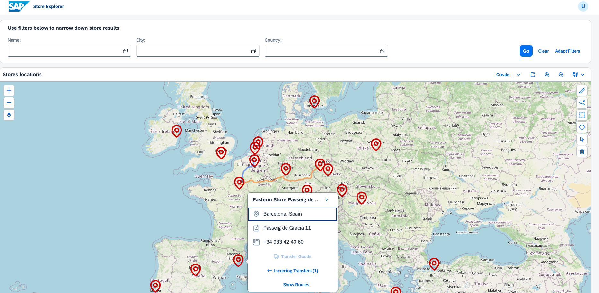

[](packages)

# Exercise 7: Full-Stack MDC Geomap with CAP

In this exercise we will explore how to build a **full-stack MDC Geomap application** powered by SAP CAP, OData V4, and advanced map interactions. Building on the JSON-based delegate from [Exercise 1](../ex1/), we now connect the MDC Geomap to a live OData service with draft-enabled CRUD, filtering, choropleth visualizations, routing, and interactive location pickers.

This is a complete application with 60 stores across 40 countries — ready to run and explore.

## Prerequisites

- [Node.js](https://nodejs.org) (latest LTS)

```bash
cd u2/ex2
npm install
npm start
```

Open http://localhost:4004/stores/

>ℹ️ The CDS server starts on port 4004 and serves both the OData API and the UI5 app via [`cds-plugin-ui5`](https://www.npmjs.com/package/cds-plugin-ui5). No separate frontend server needed!

### Test Credentials (Mocked Auth)

| User | Password | Role |
|------|----------|------|
| `admin@test.com` | `123` | Admin (full CRUD) |
| `employee@test.com` | `123` | Employee (read-only) |

---

## Step 1: Understand the Project Architecture

This exercise is a **monorepo** with two packages connected via npm workspaces:

```
u2/ex2/
├── packages/
│   ├── server/          ← CAP backend (OData V4 + SQLite)
│   └── ui-stores/       ← Freestyle SAPUI5 frontend (MDC controls)
```

Let's look at the data model. The CAP schema defines four entities with associations and compositions:

###### packages/server/db/schema.cds
```cds
namespace sap.ui5.stores;
using { managed, cuid } from '@sap/cds/common';

entity Store : managed {
  key ID        : UUID;
  name          : String(200);
  address       : String(300);
  city          : String(100);
  country       : String(100);
  latitude      : Decimal(10,7);
  longitude     : Decimal(10,7);
  phone         : String(30);
  openingHours  : String(100);
  inventory     : Composition of many Inventory on inventory.store = $self;
}

entity Transfer : cuid, managed {
  sourceStore   : Association to Store;
  destStore     : Association to Store;
  transferDate  : String(10);
  distance      : Decimal(8,1);
  co2Emissions  : Decimal(8,2);
  status        : String(20);
  items         : Composition of many TransferItem on items.transfer = $self;
}
```

The OData service exposes these entities with **draft support** on Stores and **read-only** access to Transfers:

###### packages/server/srv/stores-service.cds
```cds
using { sap.ui5.stores as my } from '../db/schema';

service StoresService {
  @odata.draft.enabled
  entity Stores as projection on my.Store;
  entity Inventory as projection on my.Inventory;

  @readonly
  entity Transfers as projection on my.Transfer;
  @readonly
  entity TransferItems as projection on my.TransferItem;
}
```

>ℹ️ The `@odata.draft.enabled` annotation gives us automatic draft lifecycle — `draftEdit` → modify → `draftActivate`. The UI5 frontend uses two-way binding with auto-PATCH on draft entities, so changes are saved automatically as you type.

---

## Step 2: The OData-Driven Geomap Delegate

In Exercise 1, our delegate worked with a local JSON model. Now we evolve it to fetch data from a **live OData V4 service**. The fundamental pattern is the same — extend `GeomapDelegate`, implement `initializeGeomap`, `rebind`, and `fetchProperties` — but the data loading is completely different.

Let's look at how the delegate is declared in the view:

###### packages/ui-stores/webapp/view/Stores.view.xml
```xml
<mdc:Geomap
    id="storesGeomap"
    delegate="{
        'name': 'sap/ui/stores/delegate/StoresGeomapDelegate',
        'payload': {
            'collectionName': 'Stores',
            'spotConfig': {
                'width': '2.5rem',
                'height': '2.5rem',
                'color': '#CC0000'
            }
        }
    }"
    centerLat="48.0" centerLng="10.0" zoom="4" height="700px"
    enableSelectionControl="true"
    enableCopyrightControl="true">
</mdc:Geomap>
```

Now let's see how the delegate creates the map and loads OData spots:

###### packages/ui-stores/webapp/delegate/StoresGeomapDelegate.js: creation
```javascript
var StoresGeomapDelegate = Object.assign({}, GeomapDelegate, BaseDelegate);

StoresGeomapDelegate.initializeGeomap = function (oGeomap) {
    return StoresGeomapDelegate._createContentFromPropertyInfos(oGeomap, false);
};

StoresGeomapDelegate._createContentFromPropertyInfos = function (oGeomap, bForceRebind) {
    return new Promise(function (resolve) {
        // ... map controls setup (provider, navigation, selection, scale, copyright) ...

        var oGeomapInstance = new Geomap({
            centerLat: oGeomap.getCenterLat(),
            centerLng: oGeomap.getCenterLng(),
            zoom: oGeomap.getZoom(),
            height: oGeomap.getHeight(),
            width: oGeomap.getWidth(),
            mapControls: aMapControls,
            items: []
        });

        var oModel = oGeomap.getModel();

        // Guard: model may not be propagated yet
        if (!oModel) {
            oGeomap.setAggregation("_geomap", oGeomapInstance);
            var fnModelAvailable = function () {
                var oM = oGeomap.getModel();
                if (oM) {
                    oGeomap.detachModelContextChange(fnModelAvailable);
                    StoresGeomapDelegate._loadSpots(oGeomap, oGeomapInstance, oM);
                }
            };
            oGeomap.attachModelContextChange(fnModelAvailable);
            resolve(oGeomapInstance);
            return;
        }

        StoresGeomapDelegate._loadSpots(oGeomap, oGeomapInstance, oModel);
        oGeomap.setAggregation("_geomap", oGeomapInstance);
        resolve(oGeomapInstance);
    });
};
```

>⚠️ The **model availability guard** is critical! When the app runs in demo mode (GitHub Pages mock server), the OData model isn't propagated at the time `initializeGeomap` is called. The map tiles render immediately, and spot loading is deferred until `modelContextChange` fires. Without this guard, you'd get `Cannot read properties of undefined (reading 'bindList')`.

The actual data loading uses OData V4 list binding with `requestContexts`:

###### packages/ui-stores/webapp/delegate/StoresGeomapDelegate.js: OData binding
```javascript
StoresGeomapDelegate._loadSpots = function (oGeomap, oGeomapInstance, oModel) {
    var sDelegatePayload = oGeomap.getDelegate().payload || {};
    var sCollectionName = sDelegatePayload.collectionName || "Stores";

    // Create OData list binding with IsActiveEntity filter (drafts excluded)
    var oListBinding = oModel.bindList(
        "/" + sCollectionName, null, null,
        [new Filter({ path: "IsActiveEntity", operator: FilterOperator.EQ, value1: true })],
        { $$ownRequest: true }
    );

    oListBinding.requestContexts(0, Infinity).then(function (aContexts) {
        // Flatten to GeoJSON-like structure for the factory
        var aFlattened = aContexts.map(function (oContext) {
            var oObj = oContext.getObject();
            return {
                geometry: { type: "Point", coordinates: [parseFloat(oObj.longitude), parseFloat(oObj.latitude)] },
                properties: oObj
            };
        });

        // Bind to inner geomap with factory
        var oFlatModel = new JSONModel(aFlattened);
        oGeomapInstance.setModel(oFlatModel);
        oGeomapInstance.bindAggregation("items", {
            path: "/",
            factory: StoresGeomapDelegate._createItemFactory.bind(null, oSpotConfig, oGeomap),
            templateShareable: false
        });
    });
};
```

>ℹ️ The `BaseDelegate.js` provides `getTypeMap()` for OData V4 type resolution, and `TypeMap.js` extends the standard V4TypeMap with custom `Edm.GeographyPoint` mapping. These are the same supporting files from Exercise 1, adapted for OData.

---

## Step 3: MDC FilterBar Integration

The MDC FilterBar delegates filter field creation to a `StoresFilterBarDelegate`. Each filter property returns a `FilterField` bound to the condition model:

###### packages/ui-stores/webapp/delegate/StoresFilterBarDelegate.js
```javascript
var StoresFilterBarDelegate = Object.assign({}, FilterBarDelegate);

StoresFilterBarDelegate.fetchProperties = function (oFilterBar) {
    return Promise.resolve([
        { key: "name", label: "Name", dataType: "sap.ui.model.type.String" },
        { key: "city", label: "City", dataType: "sap.ui.model.type.String" },
        { key: "country", label: "Country", dataType: "sap.ui.model.type.String" }
    ]);
};

StoresFilterBarDelegate.addItem = function (oFilterBar, sPropertyName) {
    var oFilterField = new FilterField({
        delegate: { name: "sap/ui/mdc/field/FieldBaseDelegate", payload: {} },
        dataType: "sap.ui.model.type.String",
        conditions: "{$filters>/conditions/" + oProperty.key + "}",
        label: oProperty.label,
        maxConditions: -1
    });
    return Promise.resolve(oFilterField);
};
```

When the user clicks "Go", the controller reads conditions from the FilterBar and calls `rebind` on the delegate:

###### packages/ui-stores/webapp/controller/Stores.controller.js: onSearch
```javascript
onSearch: function () {
    var aFilters = this._getCurrentFilters();
    var oGeomap = this.getView().byId("storesGeomap");
    var oDelegate = oGeomap.getDelegate();

    sap.ui.require([oDelegate.name], function (GeomapDelegate) {
        if (that._sMapMode === "choropleth") {
            GeomapDelegate.renderChoropleth(oGeomap, aFilters);
        } else {
            GeomapDelegate.rebind(oGeomap, aFilters);
        }
    });
}
```

>ℹ️ The `rebind` method destroys the existing inner geomap and recreates it with the new filter set applied to the OData binding. This ensures spots reflect the current filter state.

---

## Step 4: Choropleth Visualization

Switching to "Regions" mode renders a choropleth map — countries/regions colored by store density. The delegate loads a bundled GeoJSON file with 16 sales regions and counts matching stores:

###### packages/ui-stores/webapp/delegate/StoresGeomapDelegate.js: renderChoropleth
```javascript
StoresGeomapDelegate.renderChoropleth = function (oGeomap, aFilters) {
    // Load sales regions GeoJSON
    var sUrl = sap.ui.require.toUrl("sap/ui/stores/model/sales_regions.geojson");
    jQuery.getJSON(sUrl + ".json", function (oGeoJSON) {
        // Count stores per region via countries_included lookup
        oGeoJSON.features.forEach(function (oFeature) {
            var aCountries = oFeature.properties.countries_included || [];
            var iCount = 0;
            aCountries.forEach(function (sCountry) {
                iCount += (mCountryCount[sCountry] || 0);
            });

            if (iCount > 0) {
                // Color scale: 4 tiers
                var sColor;
                if (iCount >= 8) { sColor = "#E65100"; }      // Dark orange
                else if (iCount >= 5) { sColor = "#FB8C00"; }  // Medium orange
                else if (iCount >= 3) { sColor = "#FFB74D"; }  // Light orange
                else { sColor = "#FFE0B2"; }                    // Pale orange

                // Handle both Polygon and MultiPolygon geometries
                var aCoordSets = oFeature.geometry.type === "MultiPolygon"
                    ? oFeature.geometry.coordinates
                    : [oFeature.geometry.coordinates];

                aCoordSets.forEach(function (aPolygonCoords) {
                    var aPoints = aPolygonCoords[0].map(function (c) {
                        return new GeomapPoint({ lng: c[0], lat: c[1] });
                    });
                    oInnerGeomap.addItem(new GeomapPolygon({
                        points: aPoints, fillColor: sColor, fillOpacity: 0.6
                    }));
                });
            }
        });
    });
};
```

>ℹ️ The GeoJSON contains `MultiPolygon` geometries (regions spanning multiple landmasses, like island nations). Each polygon ring in a MultiPolygon must be rendered separately — hence the nested `forEach`.

The mode switch between spots and choropleth is triggered by a SegmentedButton in the view:

###### packages/ui-stores/webapp/controller/Stores.controller.js: mode switching
```javascript
_switchMapMode: function (sMode) {
    if (sMode === this._sMapMode) { return; }
    this._sMapMode = sMode;

    var oGeomap = this.byId("storesGeomap");
    sap.ui.require([oGeomap.getDelegate().name], function (GeomapDelegate) {
        if (sMode === "choropleth") {
            GeomapDelegate.renderChoropleth(oGeomap, that._getCurrentFilters());
        } else {
            GeomapDelegate.rebind(oGeomap, that._getCurrentFilters());
        }
    });
}
```

---

## Step 5: Route Drawing with OSRM

Users can draw road routes between stores. Real road geometry is fetched from the OSRM demo server and rendered as a `GeomapLine`:

###### packages/ui-stores/webapp/controller/Stores.controller.js: _drawRoute
```javascript
_drawRoute: function (oStore1, oStore2) {
    var sUrl = "https://router.project-osrm.org/route/v1/driving/"
        + fLng1 + "," + fLat1 + ";" + fLng2 + "," + fLat2
        + "?overview=full&geometries=geojson";

    fetch(sUrl).then(function (oResponse) {
        return oResponse.json();
    }).then(function (oData) {
        var aPoints = [];
        if (oData.code === "Ok" && oData.routes && oData.routes.length > 0) {
            // Use real road geometry from OSRM
            oData.routes[0].geometry.coordinates.forEach(function (aCoord) {
                aPoints.push(new GeomapPoint({ lat: aCoord[1], lng: aCoord[0] }));
            });
        } else {
            // Fallback to straight line
            aPoints.push(new GeomapPoint({ lat: fLat1, lng: fLng1 }));
            aPoints.push(new GeomapPoint({ lat: fLat2, lng: fLng2 }));
        }

        oInnerGeomap.addItem(new GeomapLine({ width: 4, points: aPoints }));
    }).catch(function () {
        // Network error — draw straight line as fallback
        oInnerGeomap.addItem(new GeomapLine({ width: 4, points: [
            new GeomapPoint({ lat: fLat1, lng: fLng1 }),
            new GeomapPoint({ lat: fLat2, lng: fLng2 })
        ]}));
    });
}
```

>⚠️ The OSRM demo server is **rate-limited and for testing only** — not for production use. See the [OSRM API Policy](https://github.com/Project-OSRM/osrm-backend/wiki/Api-usage-policy). For production, deploy your own OSRM instance or use a commercial routing API (HERE, Google Maps).

### Transfer Route Visualization

The delegate and controller communicate via the UI5 **EventBus** to show transfer routes. When a user clicks "Show Routes" in a store's popover, the delegate publishes an event:

```javascript
sap.ui.getCore().getEventBus().publish("StoresMap", "ShowTransferRoutes", {
    storeId: oObj.properties.ID
});
```

The controller subscribes and draws color-coded routes:
- **Blue** (`#0050FF`) = outgoing transfers from the selected store
- **Orange** (`#FF6600`) = incoming transfers to the selected store
- Each route line is **clickable** — navigates to TransferDetail page

---

## Step 6: Area Selection (Polygon Drawing)

The `GeomapSelectionControl` enables users to draw a polygon on the map. Once the polygon is closed, a `selectionFinish` event fires. The delegate identifies which stores fall within using the **ray-casting algorithm**:

###### packages/ui-stores/webapp/delegate/StoresGeomapDelegate.js: _pointInPolygon
```javascript
StoresGeomapDelegate._pointInPolygon = function (point, polygon) {
    var x = point[0], y = point[1];
    var inside = false;

    for (var i = 0, j = polygon.length - 1; i < polygon.length; j = i++) {
        var xi = polygon[i][0], yi = polygon[i][1];
        var xj = polygon[j][0], yj = polygon[j][1];

        var intersect = ((yi > y) !== (yj > y))
            && (x < (xj - xi) * (y - yi) / (yj - yi) + xi);
        if (intersect) inside = !inside;
    }
    return inside;
};
```

Matching stores are shown in a results popover with navigation links to their detail pages.

---

## Step 7: Location Picker (Store Detail)

When editing a store in detail view, clicking anywhere on the map sets the store's coordinates. The `StoreDetailGeomapDelegate` exposes an `enableLocationPicker` method that attaches a MapLibre native click handler:

###### packages/ui-stores/webapp/delegate/StoreDetailGeomapDelegate.js: location picker
```javascript
StoreDetailGeomapDelegate.enableLocationPicker = function (oGeomap, fnCallback) {
    StoreDetailGeomapDelegate._bPickerEnabled = true;
    StoreDetailGeomapDelegate._fnLocationCallback = fnCallback;

    var oInnerGeomap = oGeomap.getAggregation("_geomap");
    StoreDetailGeomapDelegate._attachMapClickListener(oInnerGeomap);
};

StoreDetailGeomapDelegate._mapClickHandler = function (e) {
    if (!StoreDetailGeomapDelegate._bPickerEnabled) return;
    StoreDetailGeomapDelegate._fnLocationCallback({
        lat: e.lngLat.lat,
        lng: e.lngLat.lng
    });
};
```

The controller calls this and updates the draft entity coordinates:

```javascript
Delegate.enableLocationPicker(oGeomap, function (oCoords) {
    oContext.setProperty("latitude", oCoords.lat.toFixed(7));
    oContext.setProperty("longitude", oCoords.lng.toFixed(7));
    that._rebindGeomap();  // Refresh spot position
});
```

>ℹ️ Accessing the MapLibre GL JS instance requires traversing the `sap.ui.geomap.Geomap` internals via `_getMapInstance()`. Since MapLibre initializes asynchronously, the delegate uses a retry loop (500ms intervals, up to 10 attempts) to ensure the `map.on("click", ...)` handler is attached.

---

## Step 8: Transfer Flow with MDC Tables

The Transfer page demonstrates a **passive delegate** pattern — the delegate only creates an empty map canvas, while the controller manages all map content (spots + route):

###### packages/ui-stores/webapp/controller/Transfer.controller.js: conditional map
```javascript
_checkAndDrawRoute: function () {
    if (this._aSelectedGoods.length > 0 && this._oDestinationStore) {
        this.getView().getModel("transfer").setProperty("/showMap", true);
        this._drawTransferRoute(oSource, oDest, this._aSelectedGoods);
    } else {
        this.getView().getModel("transfer").setProperty("/showMap", false);
    }
}
```

The Transfer page also showcases **MDC Table with personalization** (`p13nMode="Filter,Sort"`). The `InventoryTableDelegate` provides property metadata that drives the personalization dialogs:

###### packages/ui-stores/webapp/delegate/InventoryTableDelegate.js
```javascript
var InventoryTableDelegate = Object.assign({}, TableDelegate, BaseDelegate);

InventoryTableDelegate.fetchProperties = function () {
    return Promise.resolve([
        { key: "name", label: "Name", dataType: "sap.ui.model.type.String", maxConditions: -1 },
        { key: "category", label: "Category", dataType: "sap.ui.model.type.String", maxConditions: -1 },
        { key: "type", label: "Type", dataType: "sap.ui.model.type.String", maxConditions: -1 },
        { key: "size", label: "Size", dataType: "sap.ui.model.type.String", maxConditions: -1 },
        { key: "color", label: "Color", dataType: "sap.ui.model.type.String", maxConditions: -1 },
        { key: "quantity", label: "Quantity", dataType: "sap.ui.model.type.Integer", maxConditions: -1 }
    ]);
};

InventoryTableDelegate.getFilterDelegate = function () {
    return InventoryFilterDelegate;
};
```

>⚠️ When merging custom filters with personalization filters, **never replace** `oBindingInfo.filters` — always merge with the base! The `TableDelegate.updateBindingInfo()` call sets framework-managed personalization filters. Overwriting them silently disables the p13n dialog's filter functionality.

---

## Step 9: Transfer Detail (Read-Only Map)

The TransferDetail page shows a completed transfer with a side-by-side layout (70% map / 30% summary). On route match, the controller binds the view element and draws the route:

###### packages/ui-stores/webapp/controller/TransferDetail.controller.js: route matched
```javascript
_onRouteMatched: function (oEvent) {
    var sTransferId = oEvent.getParameter("arguments").transferId;
    var sPath = "/Transfers(ID=" + sTransferId + ")";

    this.getView().bindElement({
        path: sPath,
        parameters: { $expand: "sourceStore,destStore" }
    });

    // Fetch data and draw route
    var oContext = this.getView().getModel().bindContext(sPath, null, {
        $expand: "sourceStore,destStore"
    });
    oContext.requestObject().then(function (oData) {
        that._drawRoute(oData.sourceStore, oData.destStore);
    });
}
```

The map auto-zooms to show both endpoints using a calculated bounding box.

---

## Run the Application

Run the application and explore all the scenarios we've covered — from basic store spots to choropleth visualizations, OSRM routing, polygon selection, location picking, and transfer management!

```bash
npm start
```

Open http://localhost:4004/stores/ and try:
1. Click any spot → see the popover with store details and transfer buttons
2. Use the FilterBar to search by name, city, or country
3. Switch to "Regions" mode → choropleth map with store density
4. Click "Route" → select two stores → see real road geometry
5. Click "Show Routes" in a popover → see transfer routes (blue outgoing, orange incoming)
6. Navigate to a store detail → edit → click the map to set coordinates
7. Initiate a transfer → select goods + destination → see the route appear
8. View a transfer detail → auto-zoomed route with summary



---

## Summary

The main takeaway is that the MDC delegate pattern scales naturally from simple JSON data (Exercise 1) to a full-stack CAP application with OData V4. The same three methods — `initializeGeomap`, `rebind`, and `fetchProperties` — drive everything, while the delegate implementation handles the complexity of OData bindings, async model propagation, and advanced visualizations.

Key patterns learned:
- **OData list binding + factory** for rendering spots from live data
- **Model availability guard** for async environments (demo mode, lazy loading)
- **EventBus decoupling** between delegates and controllers
- **Passive delegate** pattern (controller drives map content)
- **MDC Table personalization** with filter delegate integration
- **Always merge, never replace** framework-managed filters

---

## Third-Party Services & Licensing

| Service | Usage | License / Terms |
|---------|-------|-----------------|
| [OSRM Demo Server](https://router.project-osrm.org) | Route geometry between stores | Demo only — **not for production**. See [OSRM API Policy](https://github.com/Project-OSRM/osrm-backend/wiki/Api-usage-policy). |
| [OpenStreetMap](https://www.openstreetmap.org) | Map tile data | [ODbL License](https://www.openstreetmap.org/copyright). Attribution required. |
| [Natural Earth](https://www.naturalearthdata.com) | Sales region boundaries | Public domain. |

## License

This package is provided under the terms of the [SAP Developer License Agreement](https://tools.hana.ondemand.com/developer-license.txt).

>⚠️ This exercise depends on **SAPUI5** (`sap.ui.geomap`) and **SAP CAP** (`@sap/cds`), which require acceptance of the SAP Developer License. These are **not** open-source:
> - `sap.ui.geomap` is not part of OpenUI5 — it is a SAPUI5-only library
> - `@sap/cds` (SAP Cloud Application Programming Model) is proprietary SAP software
> - Both are free for development and learning but require the SAP Developer License for use
